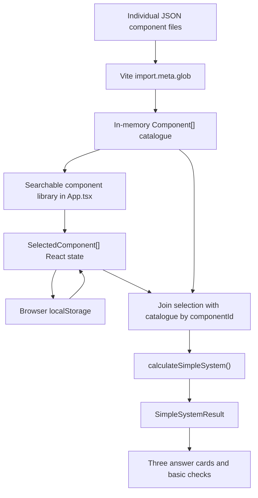

# Project architecture

This document describes the current implementation of the Community Energy Calculator as precisely as possible. It explains which file owns each responsibility, how data moves through the application, where every calculation happens, which fallback rules are used, and what the software deliberately does not model.

The document describes the code as it exists now. It is not a proposal for a future architecture.

## 1. Purpose and deliberately limited scope

The application is a static browser tool that answers three simplified questions:

1. Can the enabled inverter and enabled power source supply the enabled consumers' continuous and peak power?
2. How long can the enabled consumers run from enabled batteries that start full, while all generation is unavailable?
3. Is average enabled generation above or below average enabled consumer demand?

The user can:

- add components from a JSON catalogue;
- change quantity;
- switch each selected component on or off;
- set one percentage for each component;
- immediately see recalculated answers.

The application does not contain:

- a backend;
- a database server;
- accounts or authentication;
- a time-series simulation;
- schedules or time resolution;
- weather data;
- arbitrary electrical topology;
- cable, fuse, protection, or standards calculations.

## 2. Technology and dependencies

Runtime dependencies:

- `react`: component rendering and state;
- `react-dom`: mounting the React application in the HTML document.

Development-only dependencies:

- Vite and the React Vite plugin;
- TypeScript;
- Vitest;
- ESLint and TypeScript ESLint;
- Prettier;
- AJV and `ajv-formats` for JSON Schema validation;
- `tsx` for executing TypeScript maintenance scripts.

There is no charting, icon, form-state, routing, or runtime schema-validation library.

## 3. Repository layout

```text
.
├── .github/
│   ├── ISSUE_TEMPLATE/
│   │   ├── add-component.yml
│   │   └── config.yml
│   ├── PULL_REQUEST_TEMPLATE.md
│   └── workflows/
│       ├── create-component-pr.yml
│       ├── deploy-pages.yml
│       └── validate-components.yml
├── data/
│   ├── consumers/
│   ├── converters/
│   ├── generators/
│   └── storage/
├── docs/
│   ├── architecture.md
│   ├── calculations.md
│   ├── data-model.md
│   └── local-development.md
├── schemas/
│   ├── component.schema.json
│   ├── consumer.schema.json
│   ├── converter.schema.json
│   ├── generator.schema.json
│   └── storage.schema.json
├── scripts/
│   ├── issue-to-component.ts
│   └── validate-data.ts
├── src/
│   ├── calculation/core.ts
│   ├── contribution/parser.ts
│   ├── data/catalog.ts
│   ├── models/types.ts
│   ├── App.tsx
│   ├── main.tsx
│   ├── styles.css
│   └── vite-env.d.ts
├── tests/
│   ├── contribution.test.ts
│   └── core.test.ts
├── index.html
├── package.json
├── package-lock.json
├── tsconfig.app.json
├── tsconfig.node.json
└── vite.config.ts
```

## 4. High-level runtime data flow



All arrows in this diagram represent in-browser operations. No runtime request is sent to a backend.

## 5. Browser entry point

### `index.html`

`index.html` contains the page metadata and a single React mount element:

```html
<div id="root"></div>
```

It loads `src/main.tsx` as an ES module.

### `src/main.tsx`

`main.tsx`:

1. imports React `StrictMode`;
2. imports `createRoot` from `react-dom/client`;
3. imports the root `App` component;
4. imports the global stylesheet;
5. finds the HTML element with ID `root`;
6. renders `<App />` inside React Strict Mode.

No calculation or data loading logic is implemented in `main.tsx`.

## 6. Static component catalogue

### One file per component

Each physical or generic demonstration component is stored in one JSON file below `data/`.

Folder mapping:

| Component category | Folder             |
| ------------------ | ------------------ |
| `consumer`         | `data/consumers/`  |
| `generator`        | `data/generators/` |
| `storage`          | `data/storage/`    |
| `converter`        | `data/converters/` |

The runtime never writes these files. They are part of the compiled website.

### `src/data/catalog.ts`

The complete catalogue is loaded with:

```ts
import.meta.glob('../../data/**/*.json', {
  eager: true,
  import: 'default',
})
```

Important consequences:

- Vite discovers every JSON file below `data/` during development and build.
- `eager: true` imports every file immediately into the JavaScript bundle.
- The browser does not fetch individual JSON files after the page loads.
- Adding a new JSON file requires rebuilding the website.
- The imported module values are converted to `Component[]` using a TypeScript assertion.

Exports:

- `catalog`: the complete in-memory array;
- `componentById(id)`: returns the first component whose `id` matches, or `undefined`.

`componentById` currently exists as a convenience export. `App.tsx` performs its own `catalog.find()` when joining selections.

## 7. Type model

All shared TypeScript interfaces are defined in `src/models/types.ts`.

### Component roles

```ts
type Role = 'generator' | 'consumer' | 'storage' | 'converter'
```

A component has:

- one primary `category`;
- one or more entries in `roles`.

The calculator classifies components using `roles.includes(...)`, except for DC/AC inverters, which are identified using:

```ts
component.converterType === 'dc_ac_inverter'
```

Therefore, a converter with a different `converterType` is present in the user interface but is not counted as an inverter by the core calculation.

### `Component`

`Component` contains:

- identity and display data;
- category and role data;
- role-specific type strings;
- `electrical` values;
- `operation` values;
- source records;
- notes;
- data-quality classification.

All power, voltage, current, capacity, duration, and efficiency fields are optional because real source documents may omit them.

### Units

Units are encoded in field names:

| Suffix    | Meaning             |
| --------- | ------------------- |
| `W`       | watts               |
| `Wh`      | watt-hours          |
| `V`       | volts               |
| `A`       | amperes             |
| `Hz`      | hertz               |
| `Seconds` | seconds             |
| `Percent` | value from 0 to 100 |

Efficiencies stored in component JSON use fractions:

- `0.93` means 93%;
- `1` means 100%.

### `SelectedComponent`

User state is deliberately smaller than component data:

```ts
interface SelectedComponent {
  instanceId: string
  componentId: string
  quantity: number
  enabled: boolean
  operatingPercent: number
}
```

Field meanings:

- `instanceId`: browser-generated UUID used to update or remove this selected row;
- `componentId`: foreign key into the static catalogue;
- `quantity`: number of identical components;
- `enabled`: whether the row participates in calculation;
- `operatingPercent`: user-controlled value from 0 to 100.

### `SimpleSystemResult`

The core returns one object containing:

- overall peak answer and status;
- runtime answer and numeric hours;
- calculated summary values;
- average generation balance;
- individual checks;
- visible assumptions.

The answer status is:

```ts
type AnswerStatus = 'yes' | 'no' | 'unknown'
```

It is not a safety certification.

## 8. User interface state and persistence

All application state is owned by `App` in `src/App.tsx`.

State variables:

- `selected`: selected components and user settings;
- `query`: component search text;
- `category`: active category filter.

There is no external state-management library.

### Initial state

`initialSelection()` reads:

```text
localStorage key: simple-energy-system-v2
```

Behaviour:

1. If the key is absent, return an empty array.
2. Parse the stored JSON.
3. If the parsed value is an array, use it.
4. If parsing fails or the value is not an array, return an empty array.

The stored array is not validated against JSON Schema or a runtime TypeScript validator.

If a stored `componentId` no longer exists, the join step silently excludes that selection:

```ts
selected.flatMap(...)
```

### Writing state

Every selection change calls `setSelected(next)`:

1. update React state;
2. serialize the entire array;
3. write it to `localStorage`.

Search text and category filters are not persisted.

### Adding a component

`addComponent(component)`:

- finds an existing selected row with the same `componentId`;
- if found, increments its quantity and switches it on;
- otherwise creates a new row with `crypto.randomUUID()`.

Default percentages:

- consumer: 50%;
- generator: 50%;
- storage: 100%;
- converter: 100%.

### Updating and removing

`updateComponent(instanceId, patch)` maps over the array and shallow-merges the patch into the matching row.

`removeComponent(instanceId)` filters the matching row out.

“Clear all” stores an empty array.

### Switching off

Switching a component off does not delete it. It remains visible and persisted with `enabled: false`.

The calculation core removes disabled rows before doing any arithmetic.

## 9. Search and catalogue presentation

The catalogue filter in `App.tsx` checks:

1. category equality, unless the selected filter is `all`;
2. case-insensitive containment in a string made from name, manufacturer, and model.

The search does not currently search:

- descriptions;
- notes;
- source titles;
- electrical values;
- component IDs.

`powerLabel(component)` selects one display value:

- storage: usable capacity, falling back to nominal capacity;
- all other roles: rated power, then converter continuous output, then consumer continuous power.

If no relevant value exists, the UI displays an unknown label.

## 10. Percentage semantics

The percentage is converted by `percent(item)` in `src/calculation/core.ts`:

```ts
Math.min(100, Math.max(0, operatingPercent)) / 100
```

This clamps values to 0–100 before converting them to a fraction.

The UI range input already limits input to 0–100 in steps of 5. Clamping in the calculation additionally protects against modified or stale browser storage.

Meaning by role:

| Role           | Effect                                                        |
| -------------- | ------------------------------------------------------------- |
| Consumer       | Scales average demand only                                    |
| Generator      | Scales average generation only                                |
| Storage        | Scales usable battery energy and discharge-power availability |
| DC/AC inverter | Scales continuous and peak output availability                |

Consumer peak and continuous requirements are not scaled by the percentage. The percentage represents average use, not a reduced equipment rating.

Generator peak availability in a battery-free system uses full rated power, not the average-generation percentage.

## 11. Calculation entry point

All result calculations are performed in:

```text
src/calculation/core.ts
```

The only public calculation function is:

```ts
calculateSimpleSystem(allItems: ActiveItem[]): SimpleSystemResult
```

`ActiveItem` joins:

- the immutable catalogue `Component`;
- the mutable `SelectedComponent`.

`App.tsx` calls the function during every render. Any state change causes React to render again and calculate a new result synchronously.

The function has no browser API dependency and no side effects. This allows it to run directly in Node-based unit tests.

## 12. Initial classification

The first operation removes disabled items:

```ts
const items = allItems.filter((item) => item.selected.enabled)
```

The remaining items are classified into:

- `consumers`: role contains `consumer`;
- `generators`: role contains `generator`;
- `batteries`: role contains `storage`;
- `inverters`: `converterType` equals `dc_ac_inverter`.

An item can theoretically appear in multiple role arrays when its `roles` contains multiple values.

## 13. Shared total helper

`total(items, value)` performs:

```text
sum((selected value or 0) × quantity)
```

Exact implementation rule:

```ts
;(value(component) ?? 0) * selected.quantity
```

Therefore, a missing value passed through this helper contributes zero. It does not automatically produce an unknown result.

Individual checks explicitly produce `unknown` only where such handling is implemented.

## 14. Consumer calculations

### Average demand

For every enabled consumer:

```text
continuousPowerW × quantity × operatingPercent / 100
```

Then sum all consumers:

```text
averageDemandW =
Σ(continuousPowerW × quantity × consumer percentage)
```

If `continuousPowerW` is missing, that consumer contributes 0 W to average demand.

### Continuous demand

```text
continuousDemandW =
Σ(continuousPowerW × quantity)
```

The consumer percentage does not reduce continuous demand for the compatibility check.

### Peak demand

For every consumer:

```text
component peak =
startupPowerW when present
otherwise continuousPowerW
```

Then:

```text
peakDemandW =
Σ(component peak × quantity)
```

All enabled consumers are assumed to peak simultaneously. This is intentionally conservative and simple.

`startupDurationSeconds` is stored in component data but is not currently used by the core calculation.

## 15. Generator calculations

### Average generation

```text
averageGenerationW =
Σ(ratedPowerW × quantity × generator percentage)
```

This value is used only in the average power balance.

It is not a weather forecast, solar model, or wind model.

### Maximum generation

```text
maximumGenerationW =
Σ(ratedPowerW × quantity)
```

The percentage is deliberately not applied here. This value represents the listed maximum available power for the simplified battery-free peak check.

## 16. Battery calculations

### Available battery energy

```text
usableBatteryWh =
Σ(usableCapacityWh × quantity × battery percentage)
```

Only `usableCapacityWh` is used. `nominalCapacityWh` is not used as a fallback in the calculation, even though the UI display label may fall back to nominal capacity.

### Available discharge power

For each battery, the preferred source is:

```text
maximumContinuousDischargePowerW
```

If that field is absent, the fallback is:

```text
maximumContinuousDischargeCurrentA × nominalVoltageV
```

Then:

```text
batteryDischargeW =
Σ(selected discharge power × quantity × battery percentage)
```

If both direct power and the current/voltage fallback are unavailable, that battery contributes 0 W.

### Battery efficiency

Only the first enabled battery's:

```text
operation.dischargeEfficiency
```

is used.

Fallback:

```text
1
```

This means multiple batteries with different efficiencies are not weighted or modelled separately.

## 17. Inverter calculations

Only components with:

```text
converterType === 'dc_ac_inverter'
```

are included.

### Continuous output

```text
inverterContinuousW =
Σ(output.continuousPowerW × quantity × inverter percentage)
```

### Peak output

For every inverter:

```text
component peak =
output.peakPowerW when present
otherwise output.continuousPowerW
```

Then:

```text
inverterPeakW =
Σ(component peak × quantity × inverter percentage)
```

### Inverter efficiency

Only the first enabled inverter's:

```text
electrical.efficiency.nominal
```

is used.

Fallback:

```text
1
```

Efficiency curves stored in component data are not used by this simplified calculator.

## 18. Check: consumers exist

When no consumer is enabled, the result contains:

```text
status: unknown
title: No consumers switched on
```

This check is informational and leads to an overall unknown peak answer.

## 19. Check: inverter power

If consumers exist but no DC/AC inverter is enabled:

```text
status: no
title: No inverter switched on
```

The current simplified implementation treats all consumers as requiring a DC/AC inverter. It does not branch based on `inputType`.

When one or more inverters are enabled, the inverter check is `yes` only if both are true:

```text
inverterContinuousW >= continuousDemandW
inverterPeakW >= peakDemandW
```

Otherwise it is `no`.

## 20. Required source-side peak power

Before checking battery or direct generator power:

```text
requiredSourceW =
peakDemandW / inverterEfficiency
```

If inverter efficiency is zero or less:

```text
requiredSourceW = peakDemandW
```

Example:

```text
consumer peak:       2,000 W
inverter efficiency: 0.90
required source:     2,222.22 W
```

This is a power-only estimate.

## 21. Check: battery power

When at least one battery exists and summed discharge power is greater than zero:

```text
battery check = yes when batteryDischargeW >= requiredSourceW
otherwise no
```

When batteries exist but summed discharge power is zero:

```text
status: unknown
title: Battery power unknown
```

## 22. Check: generator power without a battery

This branch runs only when no battery is enabled.

If enabled generators have positive rated power:

```text
generator check = yes when maximumGenerationW >= requiredSourceW
otherwise no
```

The check assumes that suitable conversion and control equipment exists.

It does not check:

- generator voltage against inverter input;
- rectifier requirements;
- MPPT controller limits;
- transient response;
- generator startup behaviour;
- weather availability at the peak moment.

When generators exist but rated power is unavailable:

```text
status: unknown
title: Generator power unknown
```

When neither battery nor generator is enabled:

```text
status: no
title: No power source switched on
```

When both batteries and generators are enabled, the battery-power branch is used for the source-side peak check. Generator power is not added to battery discharge power.

## 23. Check: battery and inverter voltage

The function compares every enabled battery with every enabled inverter.

For each battery/inverter pair:

```text
battery nominalVoltageV
```

must satisfy:

```text
inverter input.minimumVoltageV
<= battery voltage
<= inverter input.maximumVoltageV
```

Missing battery voltage, minimum input voltage, or maximum input voltage produces an `unknown` check.

This is only a nominal/range comparison. It does not calculate loaded battery voltage, voltage sag, state-dependent voltage, cable drop, or BMS cut-off behaviour.

## 24. Overall peak answer

Only the following check titles are decisive:

- `Inverter power`;
- `Battery power`;
- `Battery voltage`;
- `Generator power without a battery`;
- `Generator power unknown`;
- `No inverter switched on`;
- `No power source switched on`.

Current evaluation order:

1. If there are no consumers, answer `unknown`.
2. If any decisive check is `unknown`, answer `unknown`.
3. Otherwise, if any decisive check is `no`, answer `no`.
4. Otherwise answer `yes`.

Because unknown is checked before no, a combination containing both an unknown decisive check and a failed decisive check currently produces an overall `unknown`.

The displayed text maps:

- `yes` → “Probably yes”;
- `no` → “Probably not”;
- `unknown` → “Not enough information”.

The word “probably” is intentional: only a small subset of real compatibility conditions is checked.

## 25. Runtime without generation

### Average DC-side demand

```text
dcAverageDemandW =
averageDemandW / inverterEfficiency
```

When inverter efficiency is zero or less, `averageDemandW` is used unchanged.

### Runtime formula

Runtime is calculated only when:

```text
usableBatteryWh > 0
dcAverageDemandW > 0
```

Formula:

```text
runtimeHours =
usableBatteryWh × batteryEfficiency
-----------------------------------
dcAverageDemandW
```

Expanded:

```text
runtimeHours =
Σ(usable capacity × quantity × battery percentage)
× first battery discharge efficiency
÷
(Σ(consumer continuous power × quantity × consumer percentage)
÷ first inverter nominal efficiency)
```

### Runtime response rules

- No enabled battery: return `runtimeHours: null` and explicitly state that battery runtime cannot be calculated.
- Battery exists but usable energy or average demand is zero: return `null` and ask for a consumer with known values.
- Otherwise: display hours rounded to one decimal place.

### Runtime assumptions

- Battery starts full.
- Generation is exactly zero for the full runtime.
- Consumer average power is constant.
- Converter and battery efficiencies are constant.
- Self-discharge, ageing, temperature, voltage limits, standby power, and battery-rate effects are ignored.

## 26. Average generation balance

```text
generationBalanceW =
averageGenerationW - averageDemandW
```

Interpretation:

- zero or positive: displayed as surplus;
- negative: displayed as deficit.

The balance does not include:

- inverter losses;
- charge-controller losses;
- battery charging efficiency;
- battery charge/discharge power limits;
- curtailment;
- battery state of charge;
- time or weather.

It is an instantaneous average comparison, not an energy simulation.

## 27. Assumption messages

The result always returns human-readable assumptions:

- simultaneous consumer peak;
- full-battery/no-generation runtime;
- consumer/generator percentage meaning;
- battery percentage meaning.

When an enabled inverter has no nominal efficiency and the fallback becomes 100%, an additional optimistic-runtime warning is added.

The assumptions are displayed inside the expandable “Show all calculation assumptions” section.

## 28. Result rendering

`App.tsx` renders:

1. peak-power answer card;
2. battery-runtime answer card;
3. average balance answer card;
4. individual basic-check rows.

All displayed numeric summaries are rounded with `Math.round()`, except runtime, which uses one decimal place.

The internal calculation keeps JavaScript floating-point values until rendering.

No result is sent anywhere or stored separately.

## 29. Styling

`src/styles.css` contains the complete visual design.

There is:

- no CSS framework;
- no CSS-in-JS library;
- no component library;
- no icon package;
- no externally loaded font.

The stylesheet implements:

- desktop and mobile layouts;
- component-library cards;
- switches, quantity fields, and percentage ranges;
- answer status colours;
- disclaimer and help sections.

Responsive breakpoints currently exist at 850 px and 560 px.

## 30. GitHub repository link detection

`repositoryName()` in `App.tsx` determines the repository in this order:

1. `VITE_GITHUB_REPOSITORY` build environment variable;
2. derive owner and repository from a `*.github.io` hostname and first path segment;
3. return an empty string.

When no repository can be determined:

- GitHub navigation is hidden;
- “Suggest a new component” scrolls to the community section;
- the community section explains that repository links require configuration.

## 31. JSON Schema validation

Schemas are stored in `schemas/`.

### Base schema

`component.schema.json` checks common structure including:

- schema version;
- ID format;
- required identity fields;
- valid category and roles;
- electrical object structure;
- source presence;
- source URL and date format;
- data-quality values;
- numerical ranges such as efficiencies and percentages.

### Role schemas

Each role schema references the common schema and additionally checks:

- matching `category`;
- matching role in `roles`;
- presence of the corresponding role-specific type field.

### Validation script

`scripts/validate-data.ts`:

1. loads the common schema;
2. registers it with AJV draft 2020;
3. loads all four role schemas;
4. reads every `.json` file from the corresponding data folder;
5. validates the file;
6. checks globally unique component IDs;
7. checks that category matches folder;
8. applies additional cross-field checks.

Cross-field checks:

- startup power must not be below continuous power;
- maximum voltage must not be below minimum voltage;
- usable capacity must not exceed nominal capacity;
- converter peak output must not be below continuous output.

Any error prints all collected messages and exits with status 1.

## 32. Component Issue Form

`.github/ISSUE_TEMPLATE/add-component.yml` defines the public contribution form.

It collects:

- role and subtype;
- manufacturer, model, and readable name;
- source type, title, URL, and access date;
- basic voltage, power, peak, capacity, and efficiency values;
- notes and confirmations.

Units are included in labels.

GitHub Issue Forms do not provide a native number field. Numeric enforcement therefore happens after submission in the parser.

## 33. Issue body parsing

`src/contribution/parser.ts` contains the reusable parser.

### `parseIssueForm(body)`

GitHub converts form responses into Markdown headings:

```markdown
### Field label

Field value
```

The parser uses a regular expression to:

1. find every level-three heading;
2. collect text until the next level-three heading;
3. lowercase and trim the heading;
4. trim the value;
5. convert GitHub's `_No response_` marker to an empty string.

The output is:

```ts
Record<string, string>
```

### Strict numeric parsing

`numberOrNull(value, label)`:

- returns `null` for an empty value;
- converts one decimal comma to a decimal point;
- accepts only a complete non-negative decimal number;
- rejects letters, units, signs, spaces within the number, and trailing text;
- throws a field-specific error.

Accepted examples:

```text
48
12.5
12,5
.5
```

Rejected examples:

```text
500W
battery_power
12abc
-10
```

Efficiency is additionally limited to 0–100 and converted from percentage to fraction.

### ID normalization

`normalizeComponentId(manufacturer, model)`:

1. joins manufacturer and model;
2. lowercases;
3. applies Unicode NFKD normalization;
4. removes combining diacritical marks;
5. replaces non-alphanumeric groups with `-`;
6. removes leading and trailing hyphens.

### Role mapping

Consumer form fields map to:

- nominal voltage;
- continuous power;
- startup power and duration;
- AC input type.

Generator fields map to:

- nominal voltage;
- rated power;
- DC output type.

Storage fields map to:

- nominal voltage;
- nominal and usable capacity;
- continuous discharge power;
- discharge efficiency.

Converter fields map to:

- DC input minimum and maximum voltage;
- AC output nominal voltage;
- continuous and peak output;
- peak duration;
- nominal efficiency.

The generated object always includes source and data-quality metadata.

## 34. Issue-to-JSON script

`scripts/issue-to-component.ts`:

1. reads an issue body file passed as the first command-line argument;
2. calls `issueToComponent`;
3. determines the category folder;
4. creates the folder if necessary;
5. writes pretty-printed JSON with two-space indentation;
6. writes component metadata to `GITHUB_OUTPUT` when running in Actions.

Target folder logic:

```text
storage  → data/storage/
other    → data/<category>s/
```

Target filename:

```text
<normalized-component-id>.json
```

## 35. Automated issue-to-pull-request workflow

`.github/workflows/create-component-pr.yml` runs when an issue is opened or
reopened. Closing and reopening an older component issue therefore processes it
with the current workflow version.

The job runs when the issue has the `component submission` label or its title
starts with the Issue Form prefix `[Component]:`. The title fallback is needed
because GitHub only applies Issue Form labels that already exist in the
repository; a missing label must not cause a valid submission to be skipped.

Steps:

1. check out the repository;
2. install Node.js 22;
3. install locked dependencies with `npm ci`;
4. save the issue body in the runner's temporary directory;
5. generate the JSON component;
6. validate the complete data catalogue;
7. create a branch and pull request;
8. comment on the original issue.

The temporary issue Markdown is outside the repository working tree and is not added to the pull request.

Branch:

```text
component/<component-id>
```

The workflow never merges automatically.

If parsing or validation fails, the failure step comments on the issue and no valid pull request is created.

## 36. Tests

Vitest configuration is stored in `vite.config.ts`:

```ts
test: {
  environment: 'node',
  include: ['tests/**/*.test.ts']
}
```

### `tests/core.test.ts`

Tests cover:

- successful inverter/battery peak answer;
- insufficient inverter peak power;
- full-battery runtime;
- battery-free operation with sufficient generation;
- generator percentage and average balance;
- disabled components.

### `tests/contribution.test.ts`

Tests cover:

- normalized IDs;
- issue heading parsing;
- unit-labelled fields;
- source-backed component generation;
- missing required values;
- rejection of letters and units in numeric fields;
- decimal comma conversion.

The calculation core does not use DOM APIs, so these tests run in Node without a browser.

## 37. TypeScript projects

`tsconfig.app.json` checks browser application files:

- target ES2022;
- DOM libraries;
- strict TypeScript;
- bundler-style module resolution;
- JSON imports;
- React JSX;
- no emitted JavaScript.

`tsconfig.node.json` checks:

- Vite configuration;
- scripts;
- tests;
- imported non-React source modules.

`tsc -b` runs both referenced projects before the Vite production build.

## 38. Vite build

`vite.config.ts` configures:

- React compilation;
- Vitest;
- GitHub Pages base path.

Local base path:

```text
/
```

GitHub Actions base path:

```text
/<repository-name>/
```

Vite writes production files to:

```text
dist/
```

The `dist/` folder is ignored by Git because GitHub Pages receives it as a workflow artifact.

## 39. Validation workflow

`.github/workflows/validate-components.yml` runs:

- on pull requests;
- on pushes to `main`.

Commands:

```text
npm ci
npm run validate:data
npm test
npm run lint
npm run build
```

Any non-zero exit code fails the job.

## 40. GitHub Pages deployment

`.github/workflows/deploy-pages.yml` runs on:

- pushes to `main`;
- manual workflow dispatch.

Build job:

1. check out source;
2. install Node.js 22;
3. run `npm ci`;
4. run lint;
5. run tests;
6. validate component data;
7. build the application;
8. upload `dist/` as a Pages artifact.

Deploy job:

1. waits for the build job;
2. deploys the uploaded artifact;
3. exposes the resulting Pages URL through the GitHub environment.

No application server is deployed.

## 41. npm commands

| Command                        | Purpose                                 |
| ------------------------------ | --------------------------------------- |
| `npm run dev`                  | Start Vite development server           |
| `npm run build`                | Type-check and create production build  |
| `npm run preview`              | Serve the production build locally      |
| `npm test`                     | Run all Vitest tests once               |
| `npm run lint`                 | Run ESLint                              |
| `npm run format`               | Format repository files with Prettier   |
| `npm run validate:data`        | Validate all component JSON files       |
| `npm run component:from-issue` | Convert a saved Issue Form body to JSON |

## 42. Security and privacy boundary

At runtime:

- all calculations occur in the browser;
- selection state stays in browser local storage;
- no component selection is transmitted;
- no cookies are required;
- no analytics or tracking script is included;
- no user-supplied code is executed.

External links to sources and GitHub leave the application when clicked.

GitHub Actions process public issue content in GitHub's infrastructure. That automation is separate from normal website use.

## 43. Important current simplifications

Anyone modifying the calculator should understand these exact limitations:

- missing numeric values often contribute zero unless a dedicated unknown check exists;
- all consumers are treated as inverter loads;
- only converters explicitly typed `dc_ac_inverter` are treated as inverters;
- all enabled consumer peaks are assumed simultaneous;
- only the first inverter efficiency is used;
- only the first battery efficiency is used;
- multiple battery and inverter efficiencies are not weighted;
- battery and generator peak contributions are not combined;
- a battery-free generator check assumes suitable conversion equipment;
- nominal battery voltage is the only voltage value used in battery/inverter checking;
- generator voltage is not checked in battery-free mode;
- average generation balance ignores losses;
- runtime ignores standby load and changing battery behaviour;
- component percentages are user estimates, not measured profiles;
- there is no time dimension.

These simplifications are intentional for accessibility, but they must remain visible to users and maintainers.

## 44. Where to change specific behaviour

| Desired change                         | Primary file                                |
| -------------------------------------- | ------------------------------------------- |
| Add or change a component              | `data/<category>/...json`                   |
| Change supported component fields      | `src/models/types.ts` and schemas           |
| Change catalogue loading               | `src/data/catalog.ts`                       |
| Change power or runtime formulas       | `src/calculation/core.ts`                   |
| Change controls or result presentation | `src/App.tsx`                               |
| Change visual design                   | `src/styles.css`                            |
| Change Issue Form fields               | `.github/ISSUE_TEMPLATE/add-component.yml`  |
| Change Issue Form conversion           | `src/contribution/parser.ts`                |
| Change JSON validation                 | schemas and `scripts/validate-data.ts`      |
| Change automated PR creation           | `.github/workflows/create-component-pr.yml` |
| Change deployment                      | `.github/workflows/deploy-pages.yml`        |
| Add calculation tests                  | `tests/core.test.ts`                        |
| Add contribution parser tests          | `tests/contribution.test.ts`                |

When changing a form label, update the matching lowercase label lookup in `src/contribution/parser.ts` and its tests. The parser uses visible Markdown labels, not Issue Form IDs.

When changing a formula, update:

1. `src/calculation/core.ts`;
2. `tests/core.test.ts`;
3. `docs/calculations.md`;
4. this architecture document;
5. user-facing help text in `src/App.tsx` when the assumption is visible.
